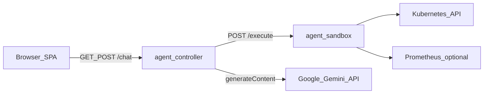

# KAI platform architecture

KAI is a read-only Kubernetes assistant composed of three runtime pieces plus static UI:

- **`agent_controller`** ([`agent_controller/`](../agent_controller)): FastAPI app. Normalizes prompt focus modes, asks Gemini to plan which tools to run, calls the sandbox for each tool, digests JSON into a short “executive summary,” then asks Gemini again for the user-facing answer.
- **`agent_sandbox`** ([`agent_sandbox/`](../agent_sandbox)): FastAPI app running in-cluster with RBAC. Exposes `POST /execute` with `{ "tool", "arguments" }`. Implements read-only `kubectl`/CRD/Prometheus work. Tool names and planner blurbs are driven by [`shared/tools.yaml`](../shared/tools.yaml).
- **Shared catalog** ([`shared/tool_catalog.py`](../shared/tool_catalog.py)): Loads [`shared/tools.yaml`](../shared/tools.yaml) so the controller planner and sandbox allow-list stay aligned.
- **Frontend** ([`frontend/`](../frontend)): Single-page app built as one `index.html`; production copies this into a ConfigMap served by nginx. Uses relative `fetch("/chat")` on the same host as `/kai/`.

## Python layout (controller)

| Area | Module |
|------|--------|
| HTTP entry | [`agent_controller/main.py`](../agent_controller/main.py) |
| `/chat` routes | [`agent_controller/routes/chat.py`](../agent_controller/routes/chat.py) |
| Orchestration | [`agent_controller/chat_orchestrator.py`](../agent_controller/chat_orchestrator.py) |
| Gemini HTTP | [`agent_controller/gemini_client.py`](../agent_controller/gemini_client.py) |
| Sandbox HTTP | [`agent_controller/sandbox_client.py`](../agent_controller/sandbox_client.py) |
| Prompt files | [`agent_controller/prompt_templates/`](../agent_controller/prompt_templates) |
| Focus snippets | [`agent_controller/prompt_modes/`](../agent_controller/prompt_modes) |
| Tool summary lines | [`agent_controller/tool_summaries.py`](../agent_controller/tool_summaries.py) |

## Python layout (sandbox)

| Area | Module |
|------|--------|
| HTTP entry | [`agent_sandbox/main.py`](../agent_sandbox/main.py) |
| Allowed tools → callables | [`agent_sandbox/registry.py`](../agent_sandbox/registry.py) |
| Tool implementations | [`agent_sandbox/tool_dispatch.py`](../agent_sandbox/tool_dispatch.py) |
| K8s clients + Prom helpers | [`agent_sandbox/clients.py`](../agent_sandbox/clients.py) |

## Images and entrypoints

- Docker images copy [`shared/`](../shared) and the package directory, plus a one-line [`agent-controller/app.py`](../agent-controller/app.py) / [`agent-sandbox/app.py`](../agent-sandbox/app.py) shim so `uvicorn app:app` keeps working.
